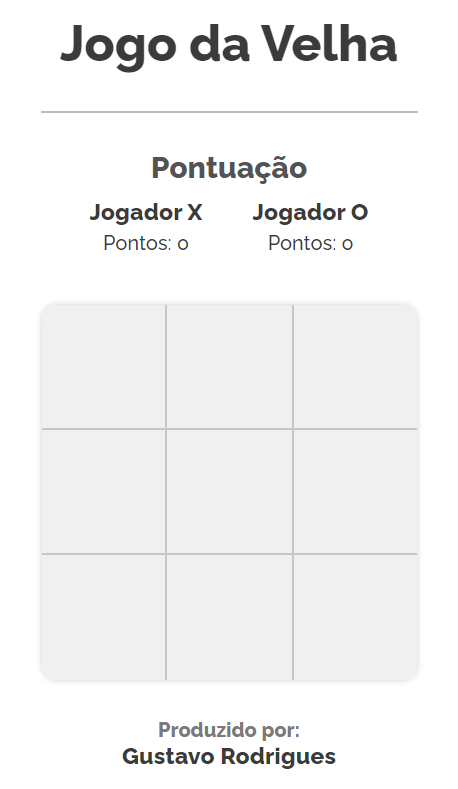
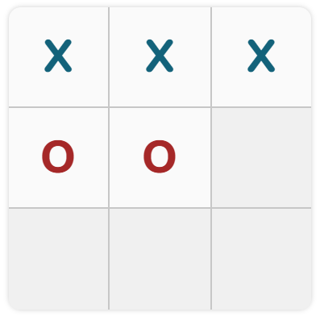
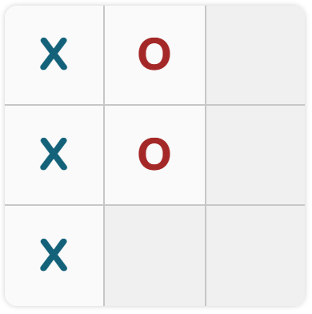
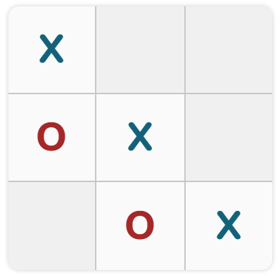

# Teste_JogoDaVelha
<meta charset="UTF-8">

<h2 style="text-align: center;" ><strong>   Teste JavaScript - Jogo da Velha</strong></h2>
 

<a href="https://gustarc.github.io/Teste_JogoDaVelha/">Link do Jogo!</a>

 
<h3><strong>Lógica do Jogo:</strong> Dois jogadores (Jogador X e O) selecionarão as casas disponíveis, quem fizer a combinação correta vencerá! &#128513</h3>

 

<h3>&#127968<strong> HTML</h3></strong>
Inicia-se pelo header contendo toda a parte acima do bloco de jogo, como título, pontuação jogadores e pontuações.
 
Logo após, existe o bloco onde de fato ocorre o jogo. Sendo englobada por uma section, seguido de uma div que engloba os botões que funcionam como as casas do jogo, cada botão tem um id próprio.

E por fim, há um footer contendo os créditos do criador.
 

 
<h3>&#127912<strong> CSS</h3></strong>
A parte necessária do CSS se resume a todas as alterações e mudanças realizadas quando algum jogador vence, o conteudo dos botões ao serem pressionados e as animações anunciando ao vencedor!

    .X::before { 
    color: rgb(19, 98, 122); 
    content: "X"; 
} 
 
.O::before { 
    content: "O"; 
    color: rgb(165, 40, 40); 
} 
 
.txtJogX { 
    text-decoration:underline; 
} 
 
.txtJogO { 
    text-decoration:underline; 
} 
 
@keyframes baixoPraCima{ 
    from {height: 0; font-size: 0;} 
    to {height: 30px; font-size: 15} 
} 
 
#ganhador.subir { 
    font-family: 'Nunito', sans-serif; 
    animation-name: baixoPraCima; 
    animation-duration: 0.25s; 
    width: 100%; 
    height: 30px; 
    display: flex; 
    align-items: center; 
    justify-content: center; 
    position: absolute; 
    top: 0; 
    font-size: 18px; 
    background-color: rgb(70, 255, 70); 
    color: rgb(4, 92, 51); 
} 
 
@keyframes CimaPraBaixo{ 
    from {height: 30px; font-size: 15} 
    to {height: 0; font-size: 0} 
} 
 
#ganhador.descer { 
    font-family: 'Nunito', sans-serif; 
    animation-name: CimaPraBaixo; 
    animation-duration: 0.25s; 
    animation-timing-function: ease-out; 
    width: 100%; 
    height: 0px; 
    display: flex; 
    align-items: center; 
    justify-content: center; 
    position: absolute; 
    top: 0; 
    font-size: 0px; 
    background-color: rgb(70, 255, 70); 
    color: rgb(4, 92, 51); 
}   
 
#ganhador.velhaSubir { 
    font-family: 'Nunito', sans-serif; 
    animation-name: baixoPraCima; 
    animation-duration: 0.25s; 
    width: 100%; 
    height: 30px; 
    display: flex; 
    align-items: center; 
    justify-content: center; 
    position: absolute; 
    top: 0; 
    font-size: 18px; 
    background-color: rgb(243, 255, 70); 
    color: rgb(92, 91, 4); 
} 
 
#ganhador.velhaDescer { 
    font-family: 'Nunito', sans-serif; 
    animation-name: CimaPraBaixo; 
    animation-duration: 0.25s; 
    animation-timing-function: ease-out; 
    width: 100%; 
    height: 0px; 
    display: flex; 
    align-items: center; 
    justify-content: center; 
    position: absolute; 
    top: 0; 
    font-size: 0px; 
    background-color: rgb(243, 255, 70); 
    color: rgb(92, 91, 4);
} 

 

 
<h3>&#128187<strong> Script</h3></strong>

É chamado a função “jogoVelha”  como ponto de partida do código! Que recebe como parâmetro o elemento - juntamente a seu id - que foi pressionado, neste caso as casas do jogo.

    document.addEventListener("click", (el) => {
    jogoVelha(el.target.id);
    });

 
 

Variáveis criadas de ínicio:

let pontosX = document.querySelector(".pontosX"); 
let pX = 1; 
let pontosO = document.querySelector(".pontosO"); 
let pO = 1; 
 
let txtJogX = document.querySelector(".jogadorX h3"); 
let txtJogO = document.querySelector(".jogadorO h3"); 
 
let checaTurno = true;
 
const jogadorX = "X"; 
const jogadorO = "O";
 
let jogX = []; 
let jogO = [];
 
let emp = 0;

let infoVencedor = document.getElementById("ganhador");

<ul>
<li><em>pontosX:</em> Será utilizado para alterar o placar. Referente ao Jogador X;</li>
<li><em>pX:</em> Contagem de pontos do jogador X;</li>
<li><em>pontosO:</em> Será utilizado para alterar o placar. Referente ao Jogador O;</li>
<li><em>pO:</em> Contagem de pontos do jogador O;</li>
<li><em>checaTurno:</em> Utilizado para alternar a vez dos jogadores;</li>
<li><em>jogadorX:</em> Utilizado para formatar a casa em prol do Jogador X;</li>
<li><em>jogadorO:</em> Utilizado para formatar a casa em prol do Jogador O;</li>
<li><em>jogX:</em> Será armazenado as casas pressionadas pelo jogador X;</li>
<li><em>jogO:</em> Será armazenado as casas pressionadas pelo jogador O;</li>
<li><em>emp:</em> Utilizado para definir empate;</li>
<li><em>infoVencedor:</em> Utilizado para informar o ganhador;</li>
</ul>

 
Função “jogoVelha” engloba como o jogo funcionará. De instante, armazenaremos todos os ids na variável “casa”.  
A variável “turno” que se define em uma condição que se “checaTurno” for true, “jogadorX” será armazenado, se não “jogadorO”. 
Em seguida, adicionaremos a classe que o turno indicará (jogador X ou O) nas casas pressionadas, assim armazenaremos posteriormente para cada jogador em formato de array separadamente. 
Prosseguindo, com o setAttribute desabilita-se o botão pressionado.
Por fim, o valor boolean de “checaTurno” será alterado, se estiver como true alterna para false e vice-versa. 

    function jogoVelha(id) {  
    const casa = document.getElementById(id); 
    turno = checaTurno ? jogadorX : jogadorO;  
    casa.classList.add(turno);  
    casa.setAttribute("disabled", true);  
    checaTurno = !checaTurno;  
    ...

 

Em um sistema de condições armazena-se o valor das casas de acordo com o jogador. Percorrerá pelo documento e se o elemento pertencer a classe X ou O será adicionado as variáveis “jogX” ou “jogO”.Será de valia para determinar o ganhador. 

if (document.getElementById(id).className == "X") {  
    jogX.push(id); 
  } else if (document.getElementById(id).className == "O") { 
    jogO.push(id); }

 

Possiveis formas de ganhar:

 
 

As seguintes condições definirão o vencedor baseado nas imagens acima.

const jogadores = [jogO, jogX] 
 
  jogadores.forEach(element => { 
    if ( 
        element.includes("n1") &&  
        element.includes("n2") && 
        element.includes("n3") 
    ) { 
        venceu(); 
    } else if ( 
        element.includes("n4") && 
        element.includes("n5") && 
        element.includes("n6") 
    ) { 
        venceu() 
    } else if ( 
        element.includes("n7") && 
        element.includes("n8") && 
        element.includes("n9") 
    ) { 
        venceu() 
    } else if ( 
        element.includes("n1") && 
        element.includes("n4") && 
        element.includes("n7") 
    ) { 
        venceu() 
    } else if ( 
        element.includes("n2") && 
        element.includes("n5") && 
        element.includes("n8") 
    ) { 
        venceu() 
    } else if ( 
        element.includes("n3") && 
        element.includes("n6") && 
        element.includes("n9") 
    ) { 
        venceu() 
    } else if ( 
        element.includes("n1") && 
        element.includes("n5") && 
        element.includes("n9") 
    ) { 
        venceu() 
    } else if ( 
        element.includes("n3") && 
        element.includes("n5") && 
        element.includes("n7") 
    ) { 
        venceu() 
    } else { 
        //empate 
        if(element.length > 2){ 
            emp++; 
        } 
        if (emp == 9) { 
            infoVencedor.classList.add("velhaSubir")    
            infoVencedor.textContent = `Deu Velha!` 
            setTimeout(() => { 
                btn_resetar() 
                jogX = []; 
                jogO = []; 
                emp = 0 
                infoVencedor.classList.remove ("velhaSubir")   
                infoVencedor.textContent = ``   
                infoVencedor.classList.add("velhaDescer") 
                setTimeout(() => { 
                    infoVencedor.classList.remove ("velhaDescer")   
                }, 300) 
            }, 500)
        }
    }
  }); 

A variável "jogadores" armazena os arrays contendo as casas pressionadas pelos jogadores X e O.
Sendo que “jogadores” está junto ao forEach que tem como objetivo passar por cada index dos arrays aplicando alguma função. Neste caso, o forEach analisará a condição que se algum dos arrays tiver incluído as combinações necessárias para ganhar chamará a função “venceu()”, se não executará a parte de empate do código que abordaremos a frente.
 
 

A função "venceu()" tem como objetivo redefenir os campos e variaveis e contabilizar os pontos.

function venceu() { 
    if (turno == jogadorX) { 
        txtJogX.classList.add("txtJogX") 
        setTimeout(() => { 
            txtJogX.removeAttribute("class") 
        }, 800) 
    } else { 
        txtJogO.classList.add("txtJogO") 
        setTimeout(() => { 
            txtJogO.removeAttribute("class") 
        }, 800) } 
    infoVencedor.classList.add("subir")    
    infoVencedor.textContent = `Jogador ${turno} Ganhou!!!` 
    ...

A primeira estrutura de condições é somente para fins estéticos com a função de aplicar e remover uma classe para o ganhador. Nota-se que retirar a classe ocorrerá após o determinado tempo, isso porque o setTimeout engloba esta parte. Ressalta-se, que logo após, o “infoVencedor” anunciará o ganhador com uma animation definida no CSS.
 
 

setTimeout(() => {  
        let alterarPlacar = !checaTurno ? pontosX : pontosO; 
        let alterarPontos = !checaTurno ? pX++ : pO++; 
        alterarPlacar.textContent = `Pontos: $ {alterarPontos}`; 
        emp = 0 
        btn_resetar() 
        jogX = []; 
        jogO = []; 
        checaTurno = !checaTurno 
        infoVencedor.classList.remove("subir")   
        infoVencedor.textContent = ``   
        infoVencedor.classList.add("descer") 
        setTimeout(() => { 
            infoVencedor.classList.remove("descer")   
        }, 300) 
    }, 500); } 

Prosseguindo, dentro do setTimeout acontecerá as principais virtudes da função. Com as variáveis “alterarPlacar” e “alterarPontos” altera-se os pontos dos jogadores, “alterarPlacar” tem o objetivo de sinalizar de quem os pontos mudarão e “alterarPontos” com função de contabilizar os mesmos, a sintaxe abaixo é onde as mudanças mencionadas ocorrerão.

Logo após, o contabilizador do empate ("emp") será redefinido para quando uma nova rodada se iniciar não haver conflito.
A função “btn_resetar” tem como objetivo redefinir os valores das casas.
Em seguida, reinicia os arrays “jogX” e “jogO”, troca o turno entre os jogadores e termina a animação do “infoVencedor”.
 
 

Função "btn_resetar()"

  function btn_resetar() { 
    const childrens = document.getElementsByClassName("jogoVelha")[0].children; 
        for (let children of childrens) { 
            children.removeAttribute("class") 
            children.removeAttribute("disabled") 
        }
  }
}

Percorre pelo bloco definido pela classe "jogoVelha" no HTML. Com o intuito de ir eliminando as tags class e disabled de cada elemento filho.
 
 

Parte de Empate:

            infoVencedor.classList.add("velhaSubir")  
            infoVencedor.textContent = `Deu Velha!`  
            setTimeout(() => { 
                btn_resetar() 
                jogX = []; 
                jogO = []; 
                emp = 0 
                infoVencedor.classList.remove ("velhaSubir")   
                infoVencedor.textContent = ``   
                infoVencedor.classList.add("velhaDescer") 
                setTimeout(() => { 
                    infoVencedor.classList.remove ("velhaDescer")   
                }, 300)
            }, 500) 

Lembra-se que esta estruturá está presente no else das condições para definir um vencedor.

Assim, ocorre o início  da animação para anunciar o empate. Logo após dentro do setTimeout chamaremos a função “btn_resetar”, reinicia os arrays “jogX”, “jogO” e “emp” e por fim termina a animação.

 

<h3>&#128214<strong> Conteúdos utilizados vistos no curso <em>COD3R - Fundamentos de JavaScript Funcional</em></h3></strong>
<ul>
 
<li><strong>Callbacks</strong></li>
<ul>
<li>Se trata de chamar uma função dentro de outra função;</li>
<li>De extrema valia, pois agiliza muitas situações e facilita para alterações futuras já que torna o código mais fácil de compreender, além de proporcionar novas possibilidades.
</li>
</ul>
 
<li><strong>forEach</strong></li>
<ul>
<li>Tem o intuito de percorrer cada item do array aplicando uma função;</li>
<li>Se torna muito prático em situações de grande escala.</li>
</ul>
</ul>
